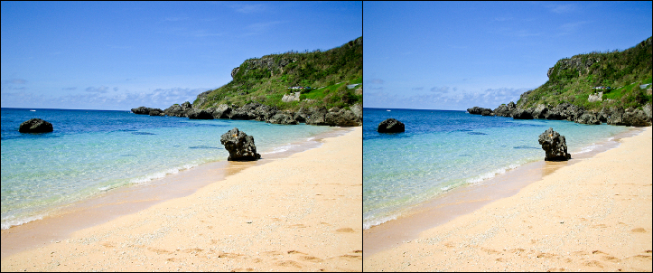
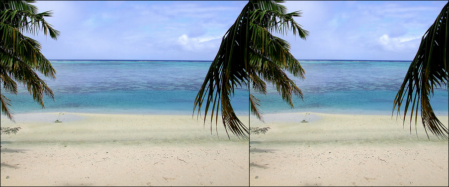
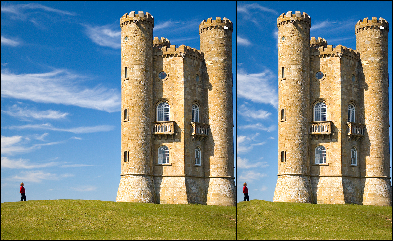
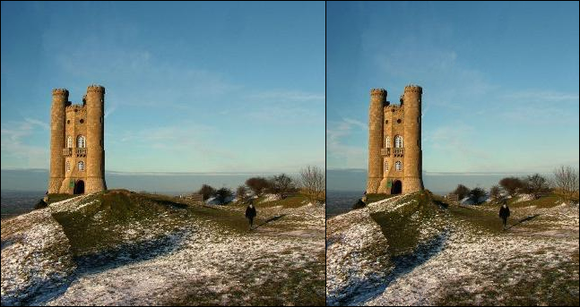

# Seam Carving

為了練習將演算法撰寫成程式的能力，我選擇了一個影像處理的演算法， Seam Carving ，研究其理論後，再將其寫成程式。在此程式中，除了讀取、儲存影像與影像資料結構是使用 OpenCV 函式庫內的函式，其餘演算法皆由自己撰寫。

## 為什麼要使用 Seam Carving

當我們以單方向(縱向/橫向)縮放影像時，會發生影像比例失真的狀況。如下圖，左為原始圖，大小為 400 * 300 ，右圖為橫向縮放後，大小為 320 * 300 。

為了避免影像比例失真的發生，我們使用 Seam Carving ，此方法是透過移除影像中不重要的區域來做單方向的影像縮放，如下圖，左為原始圖，大小為 400 * 300 ，右為 Seam Carving 處理後，大小為 320 * 300 。

比較上方二圖，可以發現經過 Seam Carving 處理的影像，其中重要的部分(石頭、山)仍保持原有比例，而不重要的部分(海洋、海岸線)被縮減。

## 其他實例

以下為其他使用 Seam Carving 處理後的圖片。左為原始圖，右為處理後的圖。

## 參考資料

[接縫裁剪 - 維基百科](https://zh.wikipedia.org/wiki/%E6%8E%A5%E7%B8%AB%E8%A3%81%E5%89%AA)
